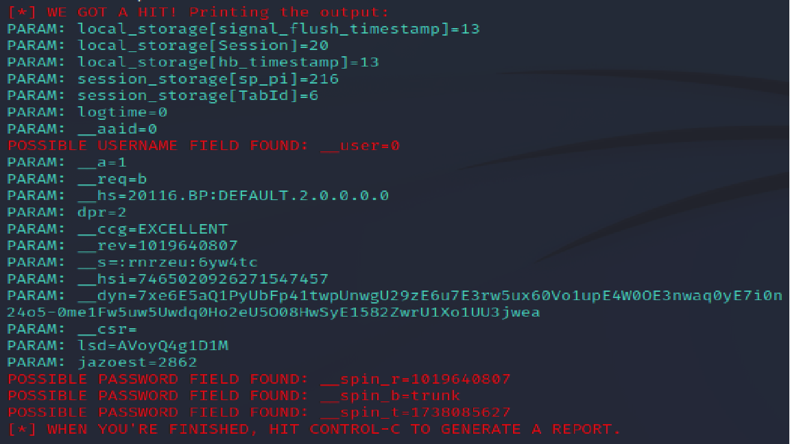
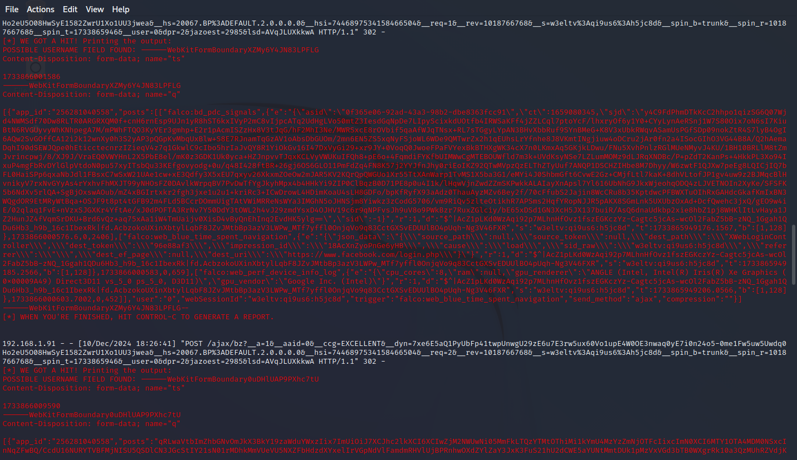
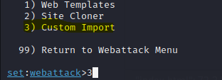
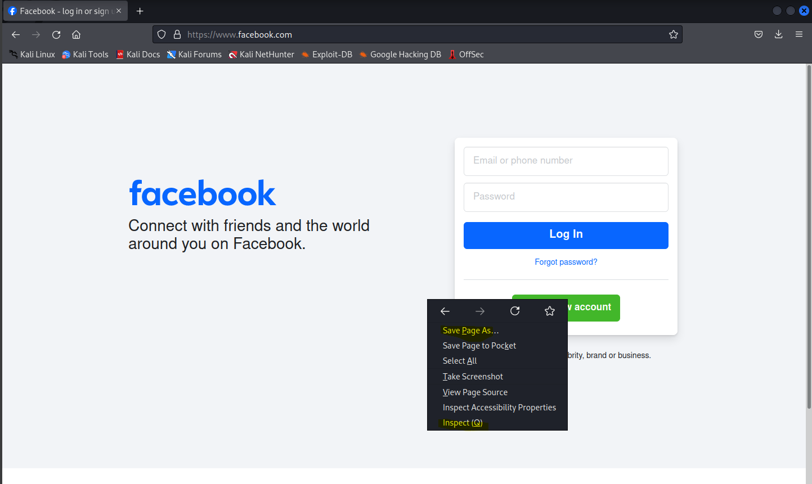

# Phishing para captura de senhas do Facebook

### Ferramentas

- Kali Linux
- setoolkit

### Configurando o Phishing no Kali Linux

- Acesso root: ``` sudo su ```
- Iniciando o setoolkit: ``` setoolkit ```
- Tipo de ataque: ``` Social-Engineering Attacks ```
- Vetor de ataque: ``` Web Site Attack Vectors ```
- Método de ataque: ```Credential Harvester Attack Method ```
- Método de ataque: ``` Site Cloner ```
- Obtendo o endereço da máquina: ``` ifconfig ```
- URL para clone: http://www.facebook.com

### Resultados



Diante disso, eu não sabia como resolver. Contudo, encontrei em um dos forks uma maneira de solucionar. No fork do Wesley Marques,encontrei a resposta.
Abaixo eu estou colocando o direcionamento do Wesley Marques do seguinte repositório - https://github.com/Weslley22Marques/cibersecurity-desafio-phishing/commits?author=Weslley22Marques em que ensina como é possível quebrar a defesa do Facebook e conseguir o nome e a senha.

Defesa Facebook
->Observe abaixo que atualmente o site do Facebook possui uma proteção contra script maliciosos.


Alternativa contra defesa
->Uma possibilidade de resolução do caso, está no próprio setoolkit onde se pode realizar Custon Import. Nesta opção iremos realizar uma clonagem e em seguida uma pequena edição no código fonte original.


Salvar página e ID button
->Na página original, iremos salvar a página com o nome index.html e em seguida iremos inspecionar o botão Log In.


->Em seguida iremos indentificar o button ID.
[Alt text](./pagface2.png "Optional title")

Editando código fonte
->Em seguida iremos copiar o código fonte do site 'www.facebook.com' e colar no nosso arquivo index.html
[Alt text](./pagface3.png "Optional title")

->Agora no código fonte iremos identificar em qual script o button ID está sendo chamado e em seguida apagar.
[Alt text](./codigfonte.png "Optional title")

->Em seguida no setoolkit iremos selecionar a opção Custom Import e apontar para a pasta onde o código fonte manipulado se encontra.

->Copie o diretorino da pasta onde se localiza o código fonte manipulado.

->Cole o diretório no setoolkit.

[Alt text](./direnosetoolkit.png "Optional title")

->Selecione Copy the entire folder
[Alt text](./copyentirefold.png "Optional title")

->Em seguida defina a URL do site importado.
 Vai aparecer no kali a opção de escolher entre duas opções: Você vai escolher set:webattack> URL of the website you imported: 
 E aí você digita www.facebook.com

 Depois disso feito, você consegue o nome do usuário e a senha. Não coloquei aqui o que ele conseguiu. Caso você queira, acesse o link do repositório dele e verá que ele conseguiu. Obrigado, Wesley Marques!